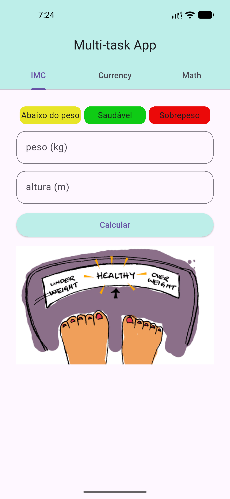
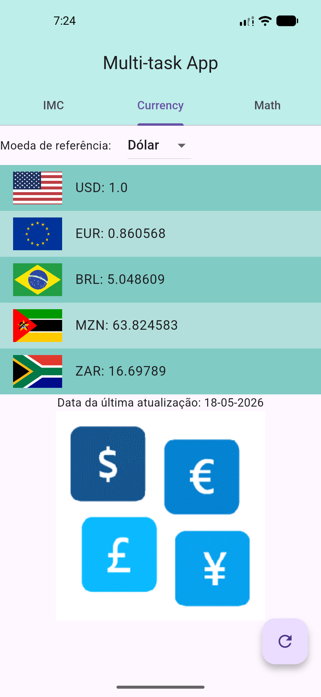
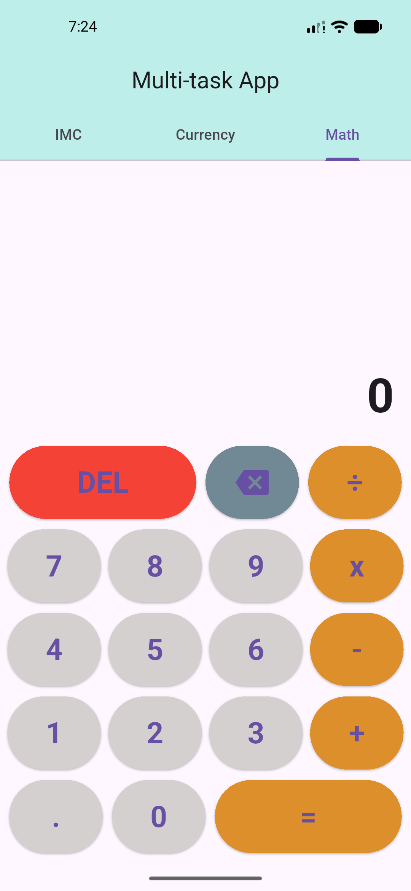

# multi_task_app

Aplicativo Android/iOS desenvolvido em flutter/dart para três tarefas:
- Cálculo de índice de massa corporal;
- Consulta do câmbio do dia (Dólar, Euro, Real, Metical e Rand);
- Calculadora básica de matemática;

## Calculadora de IMC
A calculadora de imc tem dois campos para inserir o peso e altura. Após clicalr em calcular o resultado é exibido no topo da página.

## Consulta de taxa de câmbio
A consulta de taxa de cambio é feita escolhendo uma dentre as 5 opcoes disponíveis: Dólar, Euro, Real, Metical e Rand. 

## Calculadora
A calculadora opera as 4 operações básicas: adição, subtração, divisão, e multiplicação.

